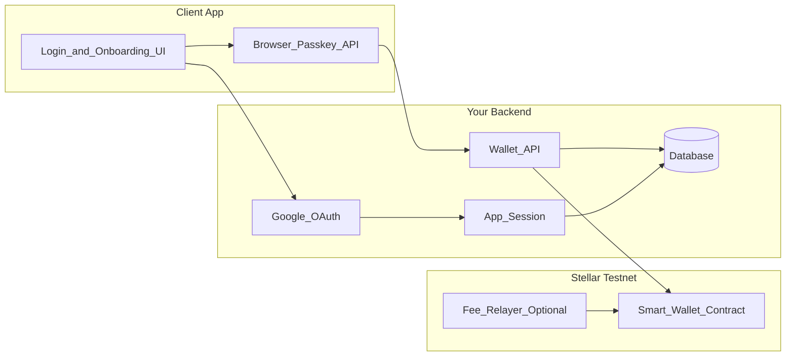
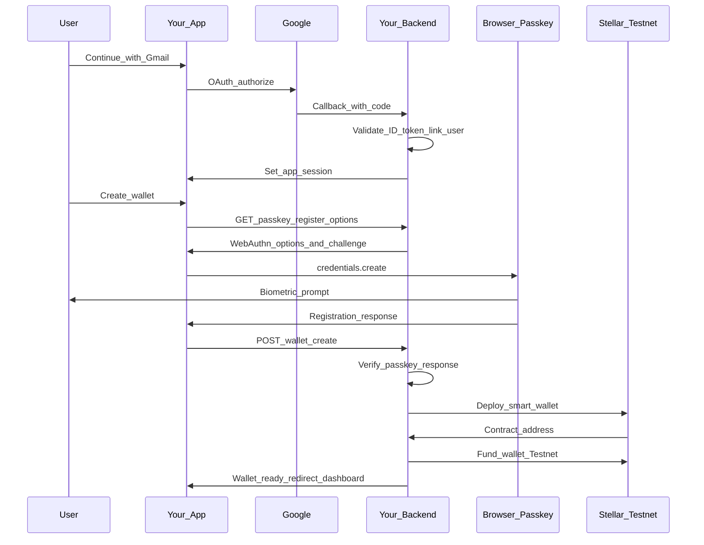
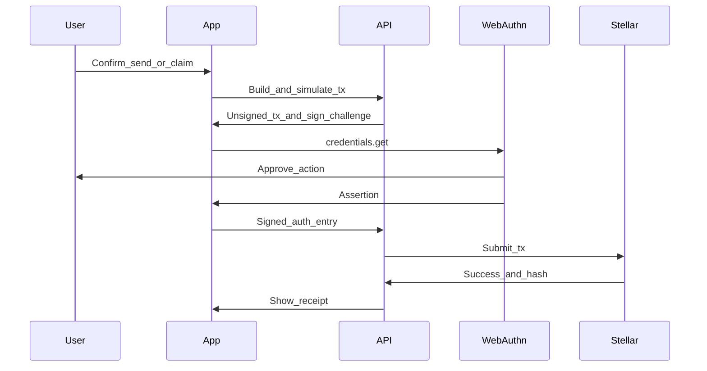

# Stellar Smart Wallet: Creation Flow & App Integration Guide

This document describes how to onboard users with a **non-custodial Stellar smart wallet** using **Google (Gmail) sign-in** for identity and **passkeys (WebAuthn)** for wallet control. It is written so the same pattern can be adopted in any web app, not only TonkiApp.

---

## What You Are Building

| Layer | Responsibility | Who controls it |
|-------|----------------|-----------------|
| **Identity** | Know who the user is | Google OAuth (`sub`, email) |
| **Wallet** | Hold assets and authorize on-chain actions | User's passkey + Soroban smart wallet contract |
| **App session** | Gate access to your backend and UI | Your server (JWT / httpOnly cookie) |

**Gmail does not sign transactions.** It only proves account identity. The passkey signs wallet actions; the smart wallet contract verifies those signatures on Stellar.

---

## High-Level Architecture



---

## Wallet Creation Flow (Step by Step)

### Phase 1: Identity (Google OAuth)

1. User clicks **Continue with Gmail**.
2. Your app redirects to Google with `state`, `nonce`, PKCE, and scopes `openid email profile`.
3. Google redirects back to your callback URL with an authorization code.
4. Your backend exchanges the code for tokens and validates the **ID token**:
   - `iss` = `https://accounts.google.com`
   - `aud` = your `GOOGLE_CLIENT_ID`
   - `exp` not expired
   - `email_verified` = true (recommended)
5. Extract **`sub`** (stable Google user id) and `email`.
6. **Find or create** an app user linked by `(provider, provider_subject)`, not by email alone.
7. Issue your normal **app session** (cookie or token) so the user is logged into your product.

At this point the user is authenticated in your app but may not have a wallet yet.

### Phase 2: Passkey Registration (WebAuthn)

1. If the user has no smart wallet, send them to an onboarding screen.
2. Backend generates **registration options**:
   - Random challenge (store server-side with short TTL, e.g. 5 minutes)
   - Relying party ID (`rpId`) = your production domain (e.g. `app.example.com`)
   - User display name from Google profile
   - Prefer **ES256** / `secp256r1` (required for Stellar on-chain verification)
3. Frontend calls `navigator.credentials.create()` with those options.
4. User approves with Face ID, fingerprint, or device PIN.
5. Browser returns a **credential** (public key + `credentialId`); the private key never leaves the device.

### Phase 3: Smart Wallet Deployment (Stellar / Soroban)

1. Backend verifies the WebAuthn registration response against the stored challenge.
2. Persist passkey metadata in your database (see [Data model](#recommended-data-model)).
3. Deploy or initialize a **Soroban smart wallet contract** on Stellar (Testnet first):
   - Register the passkey public key as an authorized signer in contract state.
   - The contract's `__check_auth` verifies `secp256r1` signatures via Soroban's native WebAuthn support (Protocol 21+).
4. Store the **contract address** as the user's `wallet_address`.
5. **Fund the wallet** (Testnet): use a faucet or your relayer/sponsor account so the user does not need XLM before their first action.
6. Redirect to your app dashboard with a short **first-run** experience (wallet ready, Testnet badge, optional backup passkey prompt).



---

## Transaction Flow (After Wallet Exists)

Once the wallet is created, it is **fully functional** for on-chain operations: receive assets, send payments, call Soroban contracts, claim rewards, etc.

1. **Build** the Soroban transaction (client or server simulates against RPC).
2. **Bind** the WebAuthn challenge to the specific transaction (prevents replay across different actions).
3. User **signs** with passkey (`navigator.credentials.get()`).
4. Attach the WebAuthn assertion as a **Soroban authorization entry** for the smart wallet.
5. **Submit** via your relayer (gas abstraction) or directly to Horizon/Soroban RPC.
6. Smart wallet contract **`__check_auth`** verifies the signature; if valid, the network executes the transaction.



---

## Recommended Data Model

Use separate tables so identity, wallet, and credentials can evolve independently.

```text
User
  user_id, name, email, status, ...

AuthIdentity
  provider          -- "google"
  provider_subject  -- Google "sub" (unique per provider)
  email
  user_id

SmartWallet
  user_id
  network           -- "testnet" | "mainnet"
  contract_address  -- Stellar smart wallet address
  status            -- "active" | "pending" | "disabled"

PasskeyCredential
  user_id
  wallet_id
  credential_id
  public_key        -- secp256r1 material for reference
  created_at
  last_used_at
```

**Link users by `provider_subject`, not email.** Email can change; Google's `sub` does not.

---

## How to Integrate in Any App

### 1. Prerequisites

- HTTPS in production (WebAuthn requires a secure context).
- Google Cloud OAuth client (Web application) with authorized redirect URI.
- Stellar Testnet RPC URL and network passphrase.
- A smart-wallet SDK or deployed factory contract (see [Tooling](#recommended-tooling)).
- Optional: fee sponsor / relayer for gasless UX.

### 2. Environment Variables

```env
# Google OAuth
GOOGLE_CLIENT_ID=
GOOGLE_CLIENT_SECRET=
GOOGLE_REDIRECT_URI=https://your-app.com/api/auth/google/callback

# App auth (existing pattern)
AUTH_SECRET=                    # min 32 chars

# Stellar
STELLAR_NETWORK=testnet
STELLAR_RPC_URL=https://soroban-testnet.stellar.org
STELLAR_NETWORK_PASSPHRASE=Test SDF Network ; September 2015

# Optional: sponsor Testnet fees
STELLAR_SPONSOR_SECRET_KEY=
RELAYER_URL=
```

### 3. Backend API Surface (minimal)

| Endpoint | Method | Purpose |
|----------|--------|---------|
| `/api/auth/google` | GET | Start OAuth redirect |
| `/api/auth/google/callback` | GET | Handle callback, create session |
| `/api/wallet/status` | GET | Return whether user has a wallet |
| `/api/wallet/passkey/register-options` | POST | WebAuthn registration challenge |
| `/api/wallet/create` | POST | Verify passkey, deploy wallet, save address |
| `/api/wallet/passkey/sign-options` | POST | Challenge for signing a specific tx |
| `/api/wallet/submit` | POST | Attach assertion and submit to network |

Reuse your existing session middleware for all wallet routes except OAuth start/callback.

### 4. Frontend Integration Checklist

- [ ] Primary CTA: **Continue with Gmail** on login/signup.
- [ ] Post-OAuth route guard: if no wallet → `/onboarding/wallet`.
- [ ] Passkey creation screen with clear copy (no seed phrases).
- [ ] Store only **non-secret** client hints (`wallet_address`, `credential_id`); never store private keys.
- [ ] Transaction screens call sign-options → WebAuthn get → submit.
- [ ] Show network badge (`Testnet`) until you ship mainnet.
- [ ] Keep extension wallets (e.g. Freighter) as an **advanced** path for power users.

### 5. Middleware / Route Guards

```text
Request → Verify app session
       → If protected route and no SmartWallet → redirect /onboarding/wallet
       → Else allow
```

Decouple **app login** from **wallet readiness**: a user can be logged in via Google but still completing wallet setup.

### 6. Security Essentials

| Topic | Practice |
|-------|----------|
| OAuth | Validate `state`, `nonce`, issuer, audience, expiry |
| WebAuthn challenges | Single-use, short TTL, server-stored |
| Transaction signing | Challenge derived from simulated tx hash |
| Custody | Never store seed phrases or passkey private keys |
| Recovery | Start with synced passkeys + "Add backup passkey"; avoid server-held recovery keys in production without policy review |
| Rate limiting | Apply to OAuth callback and wallet creation endpoints |

---

## Recommended Tooling

You do not need to write Soroban wallet contracts from scratch for an MVP.

| Tool | Use case |
|------|----------|
| [Smart Account Kit](https://github.com/kalepail/smart-account-kit) | Passkey smart wallets, signing, relayer-friendly flows |
| [Passkey Kit](https://github.com/kalepail/passkey-kit) | TypeScript SDK for contract accounts + passkeys |
| [SoroPass](https://github.com/justmert/soropass) | Modular passkey signer for Stellar Wallets Kit |
| [Launchtube](https://github.com/stellar/launchtube) | Submit txs, handle fees/sequence (gas abstraction) |
| [Stellar Smart Wallets docs](https://developers.stellar.org/docs/build/guides/contract-accounts/smart-wallets) | Official architecture and `__check_auth` patterns |

**Testnet first.** Prove onboarding and one real transaction (e.g. claim reward or send Testnet XLM) before mainnet.

---

## Mapping to TonkiApp (Reference)

TonkiApp already has pieces you can extend rather than replace:

| Existing piece | Role |
|----------------|------|
| `app/login/page.tsx` | Add Gmail CTA alongside Freighter |
| `app/api/auth/wallet-login/route.ts` | Pattern for wallet-linked user creation |
| `src/lib/auth/session.ts` | Reuse for app session after Google OAuth |
| `prisma/schema.prisma` `User.wallet_address` | Store smart wallet contract address |

Suggested new routes:

- `app/api/auth/google/route.ts`
- `app/api/auth/google/callback/route.ts`
- `app/onboarding/wallet/page.tsx`
- `app/api/wallet/*` as in the API table above

---

## First Milestone (Suggested)

Ship the smallest loop that proves the wallet works:

1. Gmail login → passkey wallet creation → funded Testnet wallet.
2. One transactional action (e.g. **claim welcome reward** or **send 1 Testnet asset**).
3. Show tx hash and balance on account page.

That gives new users a seamless introduction: familiar login, no seed phrase, and immediate proof the wallet is real.

---

## Glossary

| Term | Meaning |
|------|---------|
| **Passkey** | Platform-backed WebAuthn credential (Face ID, fingerprint, security key) |
| **Smart wallet** | Soroban contract account that authorizes via `__check_auth` instead of a single secret key |
| **secp256r1** | Elliptic curve used by WebAuthn; verified on Stellar since Protocol 21 |
| **Relayer / sponsor** | Service or account that pays network fees so users don't need XLM upfront |
| **Non-custodial** | Your app never holds the user's signing key; only the user's passkey/device does |

---

## Further Reading

- [Stellar Smart Wallets](https://developers.stellar.org/docs/build/guides/contract-accounts/smart-wallets)
- [Smart contract authorization](https://developers.stellar.org/docs/build/guides/auth/contract-authorization)
- [Stellar Passkey feature announcement](https://stellar.org/blog/foundation-news/introducing-the-new-stellar-passkey-feature-seamless-web3-smart-wallet-functionality-on-mainnet)
